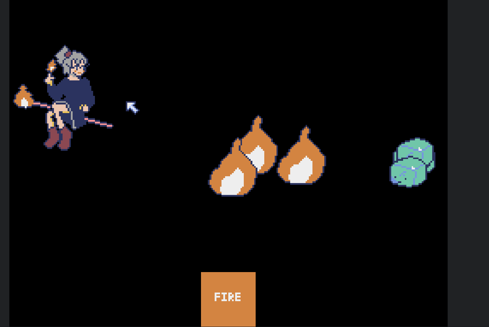

# My First Pyxel

[Pyxel](https://github.com/kitao/pyxel)で作成した試作ゲームです。ゲーム性は無いです。

[URL はこちら](https://mi-ki-ri.github.io/myfirstpyxel_html/)

## 操作方法

キーボードの右矢印キーで炎を発射します。

または、マウスでボタンをクリックすることでも発射できます。

発射した炎が敵(ゼラチナ)に当たると、敵と炎両方が消えます。

今のところ敵は何もしてきません(増えるだけ)。

[もう一度 URL はこちら](https://mi-ki-ri.github.io/myfirstpyxel_html/)
